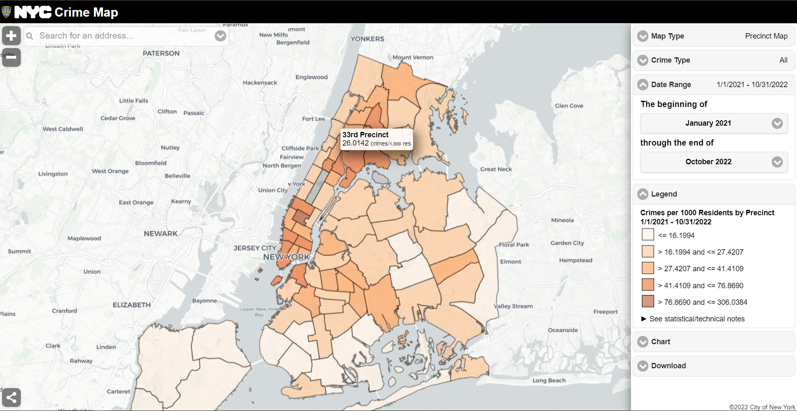

```{r setup, include=FALSE}
knitr::opts_chunk$set(echo = TRUE)
library(tidyverse)
```

# Motivation 

(Motivation: Provide an overview of the project goals and motivation)

Crime rates in New York City have been recorded since at least the 1800s. The highest crime totals were recorded in the late 1980s and early 1990s as the crack epidemic surged, and then declined continuously through the 2000s. During the 1990s, the New York City Police Department (NYPD) adopted CompStat and other strategies in a major effort to reduce crime.

It is the fact that all of our team members have heard crime alerts from NYPD frequently in the past year. Although we believe that New York City is one of the safest big cities in the United States according to the FBI, we have been so curious about the detailed information of historical crimes happened in the New York City, especially in the pattern where we are currently living.

Since in recent years the COVID-19 has brought huge effects to people's life, We are more interested in the changes of complaint each year from 2020 to 2021, especially in the Manhattan borough. In this project, we intended to explore the general information about complaint data in the past two years, and to figure out if COVID-19 influenced the rate or other attributes of crimes.

Thus, Our project aims to examine NYPD complaint data from January 2020 to December 2021 to understand the impact of COVID-19 on complaints (crimes) in Manhattan. 

# Related Work

(Related work: Anything that inspired you, such as a paper, a web site, or something we discussed in class.)



*Pictured resource: https://maps.nyc.gov/crime/*

Inspired by our regularly received crime alerts from Columbia University Department of Public Safety, when we mentioned the crime rate of NYC, all of our teammates showed great interest. When we googled it for more information, the NYC Crime Map gave us a shock on the actual number of crimes around us just from January 2021 to October 2022. 

After some initial exploring, we successfully found that resources about NYC crime and complaint data are sufficient and detailed. Based on the information we have gathered, we decided to conduct our analysis on the most recently published NYPD Compliant Data, which contained plenty of attributes correlated with each complaint of crime happened and recorded in the New York City.

# Initial Questions

(Initial questions: What questions are you trying to answer? How did these questions evolve over the course of the project? What new questions did you consider in the course of your analysis?) 


# Data

(Data: Source, scraping method, cleaning, etc.) 

The raw data we used was from **NYC OpenData: NYPD Complaint Data Historic**: https://data.cityofnewyork.us/Public-Safety/NYPD-Complaint-Data-Historic/qgea-i56i

The NYPD Complaint Data is public and readily available. The data includes all valid felony, misdemeanor, and violation crimes reported to the New York City Police Department (NYPD) from 2006 to the last updated date, which was June 9, 2022 when we started our project.

The first and the most difficult challenge we have encountered was that the original data was too large to be downloaded and analyzed - the size was over 2 GB! It took us more than half an hour to obtain the whole raw data, which contained 35 variables and more than 7 million observations.

Then the first step to handle such a huge data set was to tidy out the part that we wanted to focuse on:

```{r eval=FALSE}
nypd_complaint_data = 
  read_csv("./data/NYPD_Complaint_Data_Historic.csv") %>%
  janitor::clean_names() %>%
  drop_na(cmplnt_to_dt,cmplnt_to_tm) %>%
  separate(cmplnt_fr_dt, into = c("month", "day", "year")) %>%
  mutate(year = as.numeric(year),month = as.numeric(month), day = as.numeric(day)) %>%
  filter(year >= 2020)

write_csv(nypd_complaint_data, "./data/2020_nypd_complaint_data.csv")

nypd_complaint_2020_data = 
  read_csv("./data/nypd_complaint_data.csv") %>%
  filter(year == "2020", boro_nm == "MANHATTAN")

nypd_complaint_2021_data = 
  read_csv("./data/nypd_complaint_data.csv") %>%
  filter(year == "2021", boro_nm == "MANHATTAN")

nypd_complaint_two_year_data = 
  read_csv("./data/nypd_complaint_data.csv") %>%
  filter(year %in% c("2020", "2021"), boro_nm == "MANHATTAN")

write_csv(nypd_complaint_2020_data, "./data/nypd_complaint_2020_data.csv")

write_csv(nypd_complaint_2021_data, "./data/nypd_complaint_2021_data.csv")

write_csv(nypd_complaint_two_year_data, "./data/nypd_complaint_two_year_data.csv")
```

*Since the original data was too large to be uploaded online, we only kept it in our local repository.* After the initial cleaning of data, we made the following changes:

*   clean all the variables' name to be tidy enough to read, **drop those complaint records without exact ending date or time of occurrence**
*   separate the **exact date of occurrence for the reported event** into **month, day, year** for further analysis
*   keep only complaints occurred and recorded in year **2020** and **2021** (i.e., closely related with COVID-19 pandemic)
*   choose the borough of **Manhattan** as our study of interest (i.e., strict the pattern to where we live)
*   build new data frames from the resulted data and name as **nypd_complaint_2020_data**, **nypd_complaint_2021_data**, **nypd_complaint_two_year_data** for further analysis

```{r}
nypd_complaint_2020_data = 
  read_csv("./data/nypd_complaint_2020_data.csv")

nypd_complaint_2021_data = 
  read_csv("./data/nypd_complaint_2021_data.csv")

nypd_complaint_two_year_data = 
  read_csv("./data/nypd_complaint_two_year_data.csv")
```


After we obtained the three data sets above, **nypd_complaint_2020_data** had 88,484 observations of complaint data and **nypd_complaint_2021_data** had 101,990 observations of complaint data. **nypd_complaint_two_year_data** was the combination of data from both 2020 and 2021, which had 190,474 observations. Here were some of the important variables within all of the three data sets:

*   `cmplnt_num`: Randomly generated persistent ID for each complaint
*   `month`: Exact month of occurrence for the reported event
*   `day`: Exact day of occurrence for the reported event
*   `year`: Exact year of occurrence for the reported event
*   `addr_pct_cd`: The precinct in which the incident occurred
*   `ky_cd`: Three digit offense classification code
*   `ofns_desc`: Description of offense corresponding with key code
*   `BORO_NM`: The name of the borough in which the incident occurred
*   `susp_age_group`: Suspect’s Age Group
*   `susp_race`: Suspect’s Race Description
*   `susp_sex`: Suspect’s Sex Description
*   `latitude`: Midblock Latitude coordinate for Global Coordinate System, WGS 1984, decimal degrees (EPSG 4326)
*   `longitude`: Midblock Longitude coordinate for Global Coordinate System, WGS 1984, decimal degrees (EPSG 4326)
*   `vic_age_group`: Victim’s Age Group
*   `vic_race`: Victim’s Race Description
*   `vic_sex`: Victim’s Sex Description